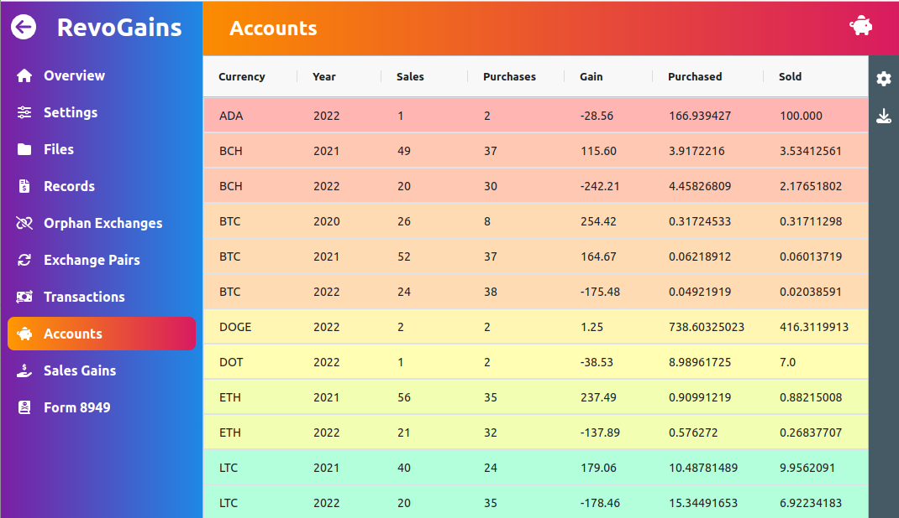

# RevoGains

RevoGains is a ReactJs app that calculates capital gains/losses on cryptocurrency transactions
made using the Revolut&trade; app/platform. And generates the corresponding Form 8949 tax forms.

The app uses the csv statements of the accounts that the user must first download from 
their Revolut&trade; accounts. The user must then upload those statements on the RevoGain app
and the rest is computed based on those statement csv files.

The app is a standalone SPA app, and does not use a backend, 
meaning that the files uploaded are only stored on the browser and are neither collected 
nor shared outside the browser.

## Screenshot



## Live Instance

If you just want to see the live app, 
a live version of the app can be found at https://revogains.audaxland.net

## Technologies used

The app is built using the following technologies:

- ReactJs: https://reactjs.org/
- Create-React-App: https://create-react-app.dev/
- TailwindCss: https://tailwindcss.com/
- Material-Tailwind: https://www.material-tailwind.com/
- Ag-Grid: https://www.ag-grid.com/
- FontAwesome: https://fontawesome.com
- PapaParse: https://www.papaparse.com/
- Pdf-Lib: https://pdf-lib.js.org/
- Dexie (IndexDB): https://dexie.org/
- YAML: https://eemeli.org/yaml
- md5, moment

## Local Installation

If you which to install the app locally, you can run the following commands

```bash
git clone https://github.com/audaxland/revoGains.git
cd revoGains
npm install
npm start
```

And go to your browser and lookup http://localhost:3000/
